# 🗄️ DIAGRAMA DE BASE DE DATOS - MINDSCHOOL

## 📊 ESQUEMA COMPLETO DE LA BASE DE DATOS


---

## 🔗 RELACIONES DETALLADAS

### 1. Relaciones de Usuario


### 2. Relaciones de Curso


### 3. Flujo de Datos Académicos


---

## 📋 DESCRIPCIÓN DE TABLAS

### Tablas Principales

#### 1. **USERS** - Usuarios del Sistema

- **Propósito**: Almacena información de todos los usuarios (admin, profesores, estudiantes)
- **Campos clave**: `id`, `name`, `email`, `password`, `avatar_url`
- **Relaciones**: Múltiples roles, cursos como instructor, inscripciones como estudiante

#### 2. **CURSOS** - Cursos/Materias

- **Propósito**: Información de los cursos disponibles
- **Campos clave**: `titulo`, `descripcion`, `instructor_id`, `estado`
- **Relaciones**: Instructor, inscripciones, lecciones, tareas

#### 3. **INSCRIPCIONES** - Relación Estudiante-Curso

- **Propósito**: Registra qué estudiantes están inscritos en qué cursos
- **Campos clave**: `user_id`, `curso_id`, `estado`, `progreso`
- **Relaciones**: Estudiante, curso

#### 4. **LECCIONES** - Contenido del Curso

- **Propósito**: Lecciones individuales dentro de un curso
- **Campos clave**: `titulo`, `contenido`, `curso_id`, `orden`
- **Relaciones**: Curso, multimedia, tareas

#### 5. **TAREAS** - Actividades Asignadas

- **Propósito**: Tareas y evaluaciones asignadas a los estudiantes
- **Campos clave**: `titulo`, `fecha_entrega`, `puntos_maximos`, `curso_id`
- **Relaciones**: Curso, lección, entregas

#### 6. **ENTREGAS_TAREAS** - Trabajos de Estudiantes

- **Propósito**: Entregas realizadas por los estudiantes
- **Campos clave**: `tarea_id`, `estudiante_id`, `calificacion`, `fecha_entrega`
- **Relaciones**: Tarea, estudiante

### Tablas de Sistema

#### 7. **ROLES** - Roles de Usuario

- **Propósito**: Define los roles disponibles (admin, profesor, estudiante)
- **Campos clave**: `name`, `guard_name`

#### 8. **MULTIMEDIA** - Contenido Multimedia

- **Propósito**: Archivos multimedia asociados a lecciones
- **Campos clave**: `titulo`, `tipo`, `url`, `leccion_id`

#### 9. **MENSAJES** - Sistema de Mensajería

- **Propósito**: Comunicación entre usuarios
- **Campos clave**: `remitente_id`, `destinatario_id`, `asunto`, `contenido`

---

## 🔄 FLUJO DE DATOS EN LA BASE DE DATOS

```mermaid
sequenceDiagram
    participant U as Usuario
    participant A as Auth
    participant C as Cursos
    participant I as Inscripciones
    participant L as Lecciones
    participant T as Tareas
    participant E as Entregas

    U->>A: Registro/Login
    A->>A: Crear/Validar token

    U->>C: Crear curso (si es profesor)
    C->>C: Guardar curso

    U->>I: Inscribirse a curso (si es estudiante)
    I->>I: Crear inscripción

    U->>L: Crear lección (profesor)
    L->>L: Guardar lección

    U->>T: Crear tarea (profesor)
    T->>T: Guardar tarea

    U->>E: Entregar tarea (estudiante)
    E->>E: Guardar entrega

    U->>E: Calificar entrega (profesor)
    E->>E: Actualizar calificación
```



---

## 📊 ÍNDICES Y OPTIMIZACIÓN

### Índices Principales

```sql
-- Usuarios
CREATE INDEX idx_users_email ON users(email);
CREATE INDEX idx_users_created_at ON users(created_at);

-- Cursos
CREATE INDEX idx_cursos_instructor ON cursos(instructor_id);
CREATE INDEX idx_cursos_estado ON cursos(estado);

-- Inscripciones
CREATE INDEX idx_inscripciones_user ON inscripciones(user_id);
CREATE INDEX idx_inscripciones_curso ON inscripciones(curso_id);
CREATE INDEX idx_inscripciones_fecha ON inscripciones(fecha_inscripcion);

-- Tareas
CREATE INDEX idx_tareas_curso ON tareas(curso_id);
CREATE INDEX idx_tareas_fecha_entrega ON tareas(fecha_entrega);

-- Entregas
CREATE INDEX idx_entregas_tarea ON entregas_tareas(tarea_id);
CREATE INDEX idx_entregas_estudiante ON entregas_tareas(estudiante_id);
```

### Consultas Optimizadas

```sql
-- Cursos de un profesor con conteo de estudiantes
SELECT c.*, COUNT(i.id) as total_estudiantes
FROM cursos c
LEFT JOIN inscripciones i ON c.id = i.curso_id
WHERE c.instructor_id = ?
GROUP BY c.id;

-- Tareas pendientes de un estudiante
SELECT t.*, c.titulo as curso_nombre
FROM tareas t
JOIN cursos c ON t.curso_id = c.id
JOIN inscripciones i ON c.id = i.curso_id
WHERE i.user_id = ? AND t.fecha_entrega > NOW()
ORDER BY t.fecha_entrega ASC;
```

---

## 🗃️ MONGODB - ALMACENAMIENTO MULTIMEDIA

### Colecciones MongoDB

```javascript
// multimedia_recursos
{
  _id: ObjectId,
  tipo: "video|imagen|audio|documento",
  descripcion: String,
  url: String,
  tags: [String],
  miniatura: String,
  metadatos: {
    duracion: Number,
    tamaño: Number,
    formato: String
  },
  created_at: Date,
  updated_at: Date
}

// usuarios_mongo (para datos adicionales)
{
  _id: ObjectId,
  user_id: Number, // Referencia a MySQL
  preferencias: {
    tema: String,
    notificaciones: Boolean,
    idioma: String
  },
  actividad: [{
    fecha: Date,
    accion: String,
    detalles: Object
  }]
}
```

---

_Este diagrama representa la estructura completa de la base de datos del sistema MindSchool, mostrando todas las relaciones entre entidades y el flujo de datos académicos._
