# 🔄 DIAGRAMAS DE FLUJO - SISTEMA MINDSCHOOL

## 📊 DIAGRAMA PRINCIPAL DEL SISTEMA

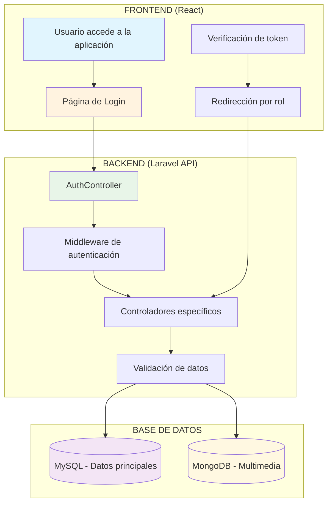

---

## 🔐 FLUJO DE AUTENTICACIÓN

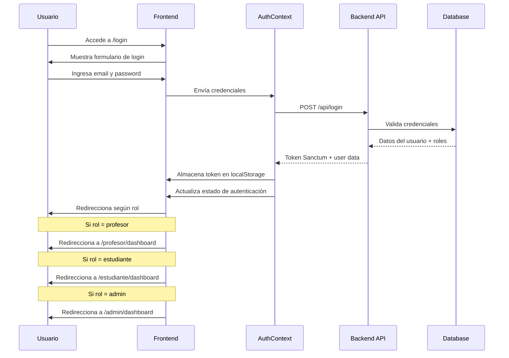

---

## 👨‍🏫 FLUJO DEL PROFESOR

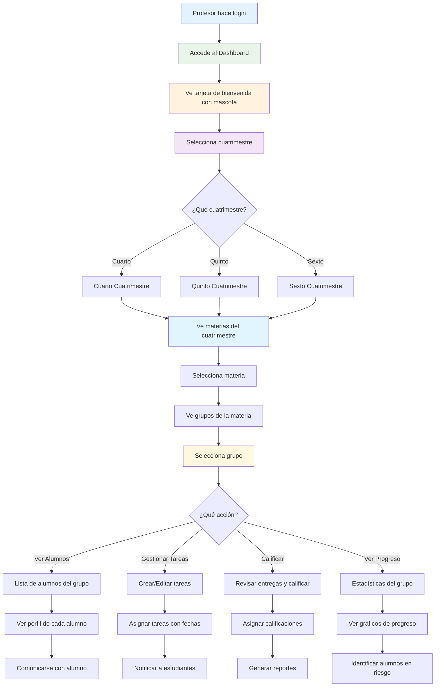

---

## 👨‍🎓 FLUJO DEL ESTUDIANTE

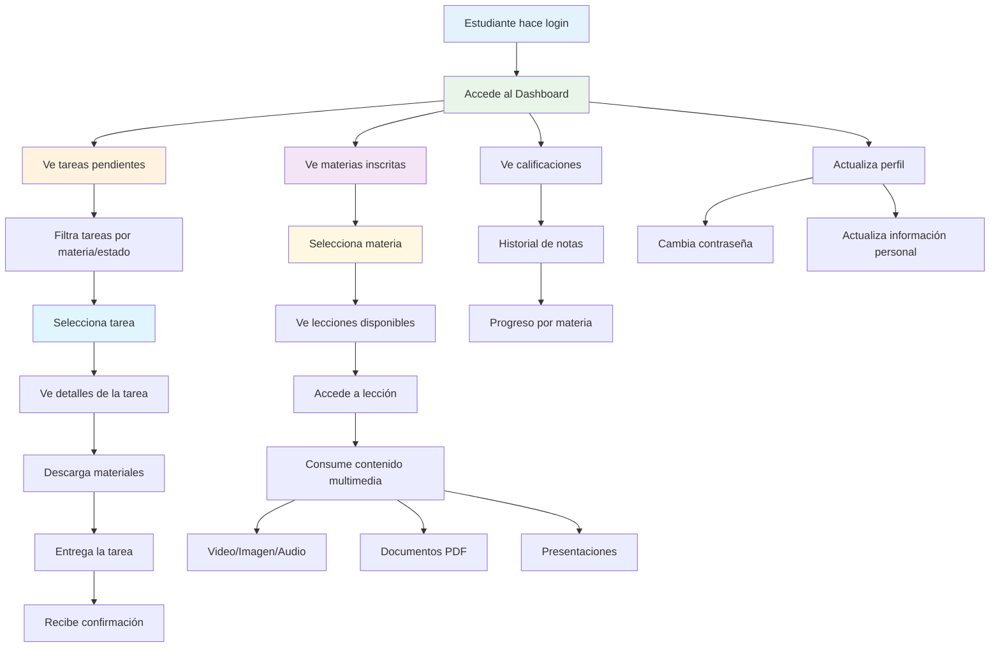

---

## 👨‍💼 FLUJO DEL ADMINISTRADOR

```mermaid
graph TD
    A[Admin hace login] --> B[Accede al Dashboard]
    B --> C[Ve estadísticas generales]

    C --> D[Usuarios activos]
    C --> E[Cursos más populares]
    C --> F[Tasa de finalización]

    B --> G[Gestión de Usuarios]
    G --> H[Crear nuevo usuario]
    G --> I[Editar usuario existente]
    G --> J[Asignar roles]
    G --> K[Desactivar usuario]

    B --> L[Gestión de Cursos]
    L --> M[Crear nuevo curso]
    L --> N[Editar curso existente]
    L --> O[Asignar instructor]
    L --> P[Configurar materias]

    B --> Q[Gestión de Inscripciones]
    Q --> R[Ver todas las inscripciones]
    Q --> S[Gestionar inscripciones]
    Q --> T[Generar reportes]

    B --> U[Reportes y Estadísticas]
    U --> V[Reporte de usuarios]
    U --> W[Reporte de cursos]
    U --> X[Reporte de rendimiento]
    U --> Y[Exportar datos]

    style A fill:#e3f2fd
    style B fill:#e8f5e8
    style G fill:#fff3e0
    style L fill:#f3e5f5
    style Q fill:#e1f5fe
    style U fill:#fff8e1
```

---

## 🔄 FLUJO DE CREACIÓN DE CURSO

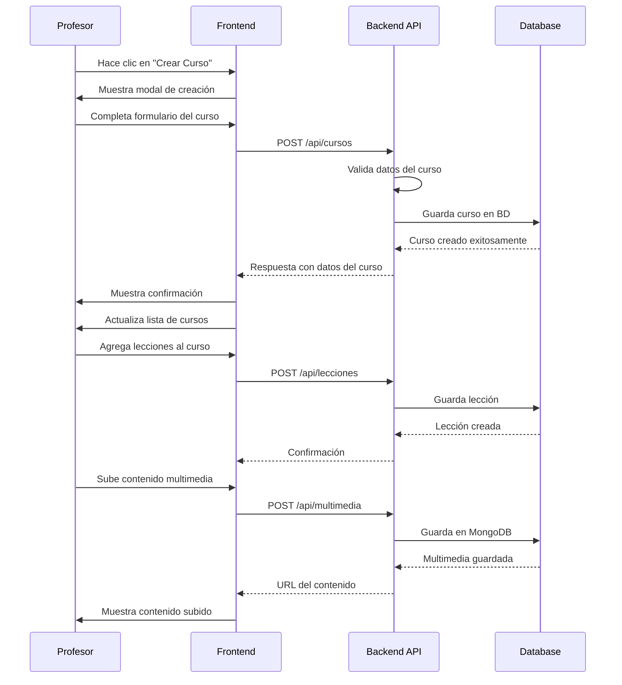

---

## 📚 FLUJO DE INSCRIPCIÓN A CURSO

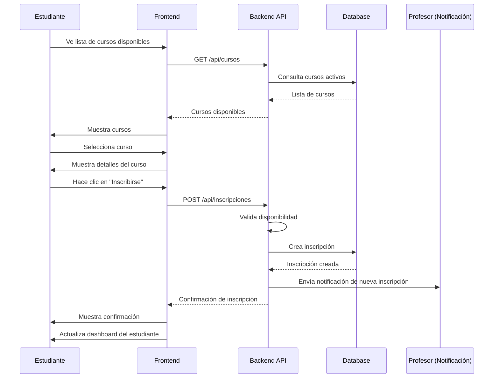

---

## 📝 FLUJO DE GESTIÓN DE TAREAS

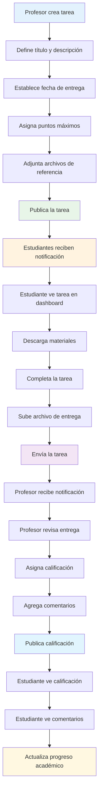

---

## 🔄 FLUJO DE DATOS EN TIEMPO REAL

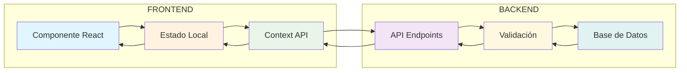

---

## 🛡️ FLUJO DE SEGURIDAD

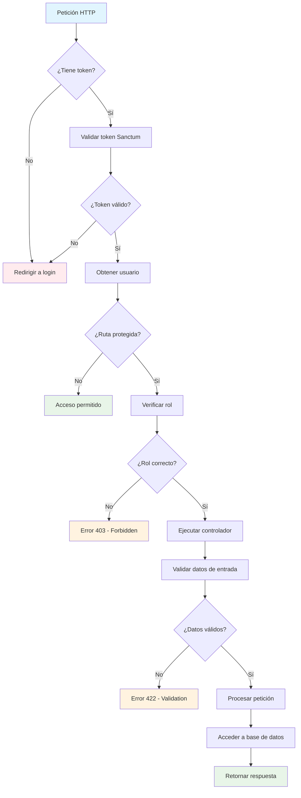

---

## 📊 ARQUITECTURA DE COMPONENTES

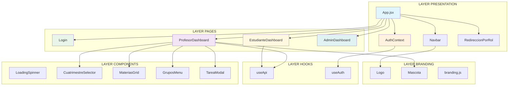

---

_Estos diagramas representan los flujos principales del sistema MindSchool, mostrando la interacción entre usuarios, frontend, backend y base de datos de manera clara y visual._
