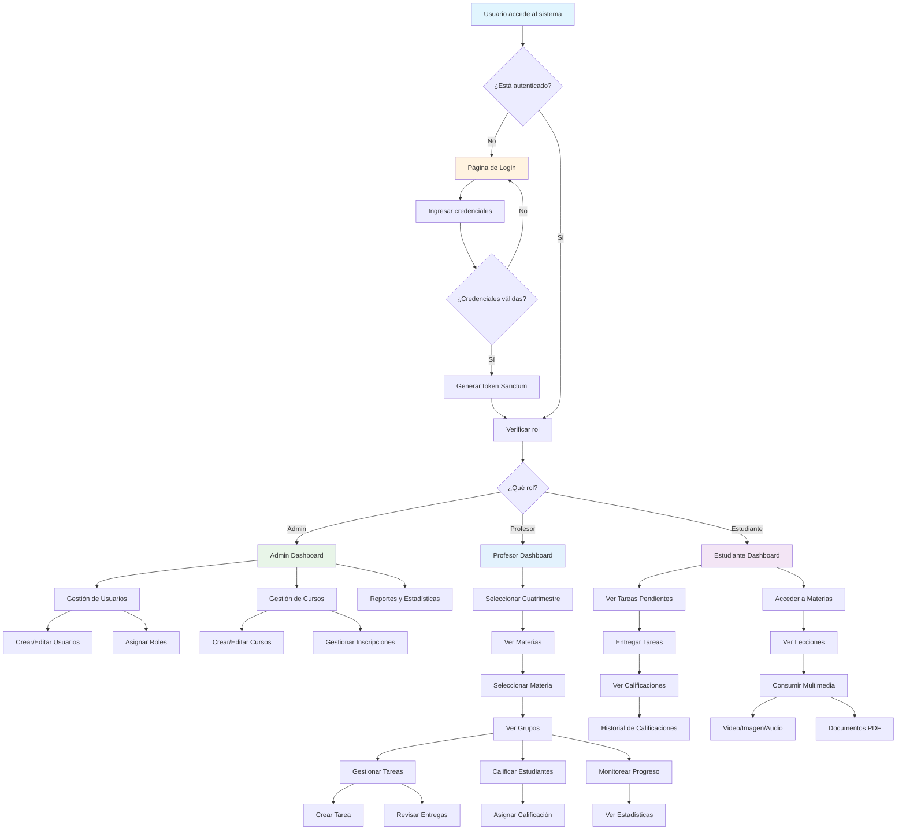
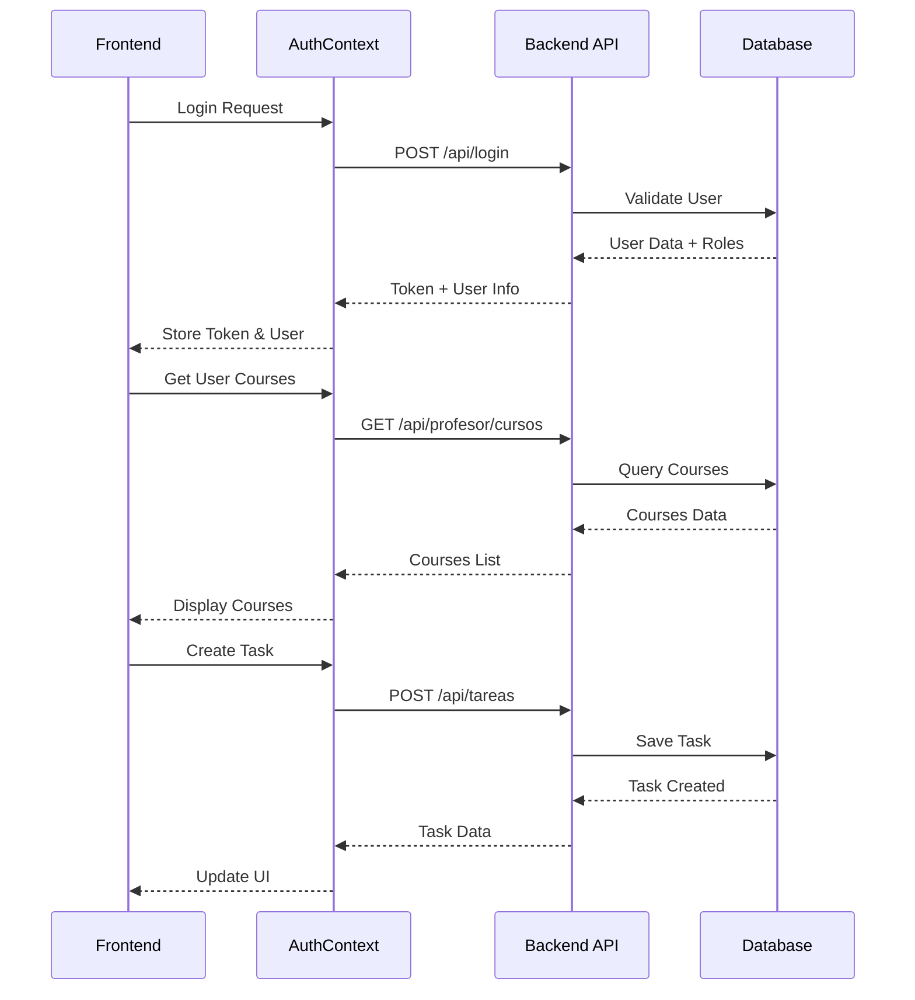

# 🎓 ESQUEMA COMPLETO DEL SISTEMA MINDSCHOOL

## 📋 ÍNDICE

1. [Arquitectura General](#arquitectura-general)
2. [Modelos de Datos](#modelos-de-datos)
3. [Flujos de Usuario](#flujos-de-usuario)
4. [API y Endpoints](#api-y-endpoints)
5. [Frontend y Componentes](#frontend-y-componentes)
6. [Seguridad y Autenticación](#seguridad-y-autenticación)
7. [Diagrama de Flujo](#diagrama-de-flujo)

---

## 🏗️ ARQUITECTURA GENERAL

### Stack Tecnológico

```
Backend: Laravel 11 + PHP 8.2 + MySQL + MongoDB
Frontend: React 18 + Vite + Axios
Autenticación: Laravel Sanctum
Base de Datos: MySQL (principal) + MongoDB (multimedia)
```

### Estructura del Proyecto

```
miprojecto_mindschool/
├── mindschool/                 # Backend Laravel
│   ├── app/
│   │   ├── Models/            # Modelos de datos
│   │   ├── Http/Controllers/  # Controladores API
│   │   └── Traits/           # Traits compartidos
│   ├── database/
│   │   ├── migrations/       # Migraciones BD
│   │   └── seeders/         # Datos iniciales
│   ├── routes/
│   │   └── api.php          # Rutas API
│   └── tests/               # Tests automáticos
└── frontend/                # Frontend React
    ├── src/
    │   ├── componentes/     # Componentes reutilizables
    │   ├── paginas/        # Páginas principales
    │   ├── contexto/       # Context API
    │   ├── hooks/          # Custom hooks
    │   └── branding/       # Sistema de diseño
    └── public/             # Assets estáticos
```

---

## 🗄️ MODELOS DE DATOS

### 1. Usuario (User)

```php
// Roles: admin, profesor, estudiante
// Relaciones principales:
- inscripciones() → Inscripcion[]
- entregasTareas() → EntregaTarea[]
- cursosInstructor() → Curso[]
```

### 2. Curso

```php
// Campos: titulo, descripcion, duracion, nivel, precio, estado, instructor_id, imagen_url
// Relaciones:
- instructor() → User
- inscripciones() → Inscripcion[]
- tareas() → Tarea[]
- lecciones() → Leccion[]
```

### 3. Inscripción

```php
// Campos: user_id, curso_id, estado, fecha_inscripcion, progreso
// Relaciones:
- alumno() → User
- curso() → Curso
```

### 4. Lección

```php
// Campos: titulo, descripcion, contenido, duracion, orden, curso_id, estado
// Relaciones:
- curso() → Curso
- multimedia() → Multimedia[]
```

### 5. Tarea

```php
// Campos: titulo, descripcion, fecha_asignacion, fecha_entrega, tipo, archivo_url, curso_id, leccion_id, estado, puntos_maximos
// Relaciones:
- curso() → Curso
- leccion() → Leccion
- entregas() → EntregaTarea[]
```

### 6. Entrega de Tarea

```php
// Campos: tarea_id, estudiante_id, archivo_url, comentarios, calificacion, comentarios_profesor, fecha_entrega, estado
// Relaciones:
- tarea() → Tarea
- estudiante() → User
```

### 7. Multimedia

```php
// Campos: titulo, descripcion, tipo, url, leccion_id, orden, estado
// Relaciones:
- leccion() → Leccion
```

### 8. Mensaje

```php
// Campos: remitente_id, destinatario_id, asunto, contenido, tipo, estado, fecha_envio, fecha_lectura
```

---

## 🔄 FLUJOS DE USUARIO

### 1. Flujo de Autenticación

```
1. Usuario accede a /login
2. Ingresa credenciales
3. Backend valida y genera token Sanctum
4. Frontend almacena token en localStorage
5. Redirección según rol:
   - admin → /admin/dashboard
   - profesor → /profesor/dashboard
   - estudiante → /estudiante/dashboard
```

### 2. Flujo de Profesor

```
1. Login como profesor
2. Accede al panel de profesor
3. Selecciona cuatrimestre
4. Ve materias asignadas
5. Selecciona materia
6. Ve grupos de alumnos
7. Gestiona tareas y calificaciones
8. Monitorea progreso de estudiantes
```

### 3. Flujo de Estudiante

```
1. Login como estudiante
2. Ve dashboard con tareas pendientes
3. Navega por materias inscritas
4. Accede a lecciones y contenido multimedia
5. Entrega tareas
6. Ve calificaciones y progreso
```

### 4. Flujo de Administrador

```
1. Login como admin
2. Gestiona usuarios y roles
3. Administra cursos y materias
4. Monitorea inscripciones
5. Genera reportes y estadísticas
```

---

## 🌐 API Y ENDPOINTS

### Autenticación

```
POST /api/register     - Registro de usuario
POST /api/login        - Inicio de sesión
POST /api/logout       - Cerrar sesión
GET  /api/user         - Obtener usuario actual
```

### Cursos (Protegido)

```
GET    /api/cursos              - Listar cursos
POST   /api/cursos              - Crear curso
GET    /api/cursos/{id}         - Ver curso específico
PUT    /api/cursos/{id}         - Actualizar curso
DELETE /api/cursos/{id}         - Eliminar curso
```

### Profesor (Protegido)

```
GET /api/profesor/dashboard           - Dashboard del profesor
GET /api/profesor/cursos              - Cursos del profesor
GET /api/profesor/cursos/{id}/estudiantes - Estudiantes del curso
GET /api/profesor/cursos/{id}/lecciones   - Lecciones del curso
POST /api/profesor/lecciones          - Crear lección
PUT /api/inscripciones/{id}/progreso  - Actualizar progreso
GET /api/profesor/cursos/{id}/estadisticas - Estadísticas del curso
```

### Estudiante (Protegido)

```
GET /api/estudiante/dashboard      - Dashboard del estudiante
GET /api/estudiante/materias       - Materias del estudiante
GET /api/estudiante/tareas-pendientes - Tareas pendientes
GET /api/estudiante/tareas/{id}    - Detalle de tarea
POST /api/estudiante/tareas/{id}/entregar - Entregar tarea
GET /api/estudiante/calificaciones - Calificaciones
GET /api/estudiante/perfil         - Perfil del estudiante
PUT /api/estudiante/perfil         - Actualizar perfil
```

### Inscripciones (Protegido)

```
GET    /api/inscripciones              - Listar inscripciones
POST   /api/inscripciones              - Crear inscripción
GET    /api/inscripciones/{id}         - Ver inscripción
PUT    /api/inscripciones/{id}         - Actualizar inscripción
DELETE /api/inscripciones/{id}         - Eliminar inscripción
GET    /api/cursos/{id}/inscripciones  - Inscripciones de un curso
```

---

## 🎨 FRONTEND Y COMPONENTES

### Estructura de Componentes

```
src/
├── componentes/
│   ├── Navbar.jsx              # Barra de navegación
│   ├── LoadingSpinner.jsx      # Spinner de carga
│   ├── RedireccionPorRol.jsx   # Redirección por rol
│   └── profesor/               # Componentes específicos de profesor
│       ├── CuatrimestreSelector.jsx
│       ├── MateriasGrid.jsx
│       ├── GruposMenu.jsx
│       ├── GrupoDetalle.jsx
│       ├── TareaModal.jsx
│       ├── CalificarModal.jsx
│       └── DetalleTareaModal.jsx
├── paginas/
│   ├── Login.jsx               # Página de login
│   ├── AdminDashboard.jsx      # Dashboard de admin
│   ├── ProfesorDashboard.jsx   # Dashboard de profesor
│   ├── ProfesorPanel.jsx       # Panel principal de profesor
│   ├── EstudianteDashboard.jsx # Dashboard de estudiante
│   └── EstudiantePanel.jsx     # Panel principal de estudiante
├── contexto/
│   └── AuthContext.jsx         # Contexto de autenticación
├── hooks/
│   └── useApi.js               # Hook para llamadas API
├── branding/
│   ├── branding.js             # Variables de diseño
│   ├── Logo.jsx                # Componente del logo
│   └── Mascota.jsx             # Componente de mascota animada
└── config/
    └── environment.js          # Configuración de entorno
```

### Sistema de Diseño

```javascript
// Colores principales
COLORS = {
  primary: "#3B82F6", // Azul principal
  secondary: "#1E40AF", // Azul oscuro
  background: "#0F172A", // Fondo oscuro
  surface: "#1E293B", // Superficie
  text: "#F8FAFC", // Texto claro
  textSecondary: "#94A3B8", // Texto secundario
  border: "#334155", // Bordes
  success: "#10B981", // Verde éxito
  warning: "#F59E0B", // Amarillo advertencia
  error: "#EF4444", // Rojo error
};
```

---

## 🔒 SEGURIDAD Y AUTENTICACIÓN

### Middleware de Protección

```php
// Rutas protegidas por autenticación
Route::middleware('auth:sanctum')->group(function () {
    // Todas las rutas que requieren login
});

// Verificación de roles en frontend
<RutaConRol rolesPermitidos={['profesor']}>
    <ProfesorDashboard />
</RutaConRol>
```

### Sistema de Roles

- **admin**: Acceso completo al sistema
- **profesor**: Gestión de cursos y estudiantes
- **estudiante**: Acceso a materias y tareas

### Validación de Datos

- Validación en backend con Laravel Validation
- Sanitización de inputs
- Protección CSRF
- Rate limiting en endpoints críticos

---

## 📊 DIAGRAMA DE FLUJO



### Flujo de Datos



---

## 🧪 TESTS Y CALIDAD

### Tests Backend

- **CursoTest**: 10 tests pasando (76 aserciones)
- **AutenticacionTest**: Validación de login/logout
- **InscripcionTest**: Gestión de inscripciones
- **Cobertura**: CRUD completo para entidades principales

### Tests Frontend

- Funcionalidad manual verificada
- Componentes reactivos y responsivos
- Manejo de errores y estados de carga

---

## 🚀 DESPLIEGUE Y PRODUCCIÓN

### Requisitos del Servidor

- PHP 8.2+
- MySQL 8.0+
- MongoDB 6.0+
- Node.js 18+
- Composer
- npm/yarn

### Variables de Entorno

```env
# Backend
DB_CONNECTION=mysql
DB_HOST=127.0.0.1
DB_PORT=3306
DB_DATABASE=mindschool
DB_USERNAME=root
DB_PASSWORD=

# MongoDB
MONGODB_URI=mongodb://localhost:27017
MONGODB_DATABASE=mindschool

# Frontend
VITE_API_URL=http://localhost:8000/api
```

---

## 📈 MÉTRICAS Y MONITOREO

### KPIs del Sistema

- Usuarios activos por rol
- Cursos más populares
- Tasa de finalización de cursos
- Tiempo promedio de entrega de tareas
- Satisfacción del usuario

### Logs y Monitoreo

- Laravel Logs para errores
- API response times
- User activity tracking
- Database performance metrics

---

_Este esquema representa el estado actual del sistema MindSchool, un LMS completo con funcionalidades para administradores, profesores y estudiantes, diseñado con arquitectura moderna y escalable._
